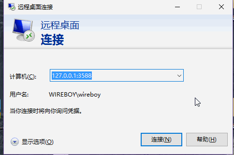

# Wireboy.Socket.P2PSocket

这是一个跨平台的项目，支持Windows、Linux、树莓派等操作系统，开发环境：.Net Core2.1 + .Net Standard2.0

喜欢此项目的，请点击一下右上角的Star

在使用过程中遇到问题，可加入QQ群417159195，与作者共同交流，入群请填写“P2PSocket”

## 你好，程序员们

这些也许是大家想要知道的

1.用到的技术：反射、多线程、异步任务、TCP通讯、文件IO、命名管道等

2.主要的实现：配置文件解析、数据封包拆包、队列日志写入、伪依赖注入（EasyInject类）等

## 这个项目能做些什么？

1.类似花生壳，将内网网站、数据库、svn等等应用部署到公网

2.不同内网的2台电脑，使用mstsc或者teamview进行远程控制

## 当前项目状态？

1.master分支版本作为稳定版本。

2.dev分支版本为开发者活跃版本，dev版本稳定后，将与master分支合并。

## 赞助名单（[>>点这里赞助](Images/alipay.md)）

[白纸坊（200RMB）](Images/Donates/2020091601.md) | [小谷哥哥（200RMB）](Images/Donates/2020091601.md)

## 视频教程

1. [P2PSocket如何编译可执行文件](https://www.bilibili.com/video/BV1ue41147p1/)

2. [简单使用P2PSocket进行远程桌面](https://www.bilibili.com/video/BV1XE411K7ca/)

## 网络结构

### 内网穿透结构


## 配置文件介绍 -> [点此查看](https://github.com/bobowire/Wireboy.Socket.P2PSocket/wiki)

## 使用方法

### 程序员：

```

1.使用"git clone https://github.com/bobowire/Wireboy.Socket.P2PSocket.git"下载源码

2.编译启动器：右键StatUp（非windows系统使用）或者StartUp_Windows（windows系统使用）项目，点击发布

3.在发布的publish目录中，建立子目录P2PSocket

4.编译项目编译Client、Core、Server项目

5.将"Client+Core"（客户端）或者"Server+Core"（服务端）的动态库拷贝到步骤3中建立的P2PSocket子目录

6.在P2PSocket目录中，添加Client.ini（客户端配置）或者Server.ini（服务端配置）文件，并参考上方的“配置文件说明”，添加相关配置项

7.双击StartUp.exe启动应用程序

```

### 普通用户：

[点此下载最新程序](https://github.com/bobowire/Wireboy.Socket.P2PSocket/releases)

```
1.下载对应平台的客户端或者服务端

2.使用win10 x64系统，以v3.1.0版本为例，在家中电脑和公司电脑下载P2PClient_win_x64.zip文件。

3.在家中电脑和公司，解压缩zip，进入P2PSocket找到Client.ini配置文件，根据需要自行修改(可参考下方的示例)。

4.在家中电脑与公司电脑运行StartUp_Windows.exe

5.打开mstsc，输入127.0.0.1:[xxxx]即可连接公司电脑

```


## 例子：mstsc远程控制（3端）

介绍：mstsc服务在远程连接时，使用3389端口，所以只需要将数据转发到3389端口即可实现mstsc的内网穿透

1.被控制端mstsc设置

windows系统：

```
鼠标右键“我的电脑” -> 点击“属性” -> 点击“远程设置” -> 勾选“允许连接到此计算机” -> 点击“确认”

```

2.服务端Server配置（假设服务器ip地址为10.10.10.10）

``` ini
#服务端设置
[Common]
#服务端口
Port=3488

[PortMapItem]
#将服务器端口12345当做客户端ClientA的3389端口使用(转发模式)
#12345->[ClientA]:3389

#将服务器端口12345当做客户端ClientA的3389端口使用(打洞模式)
#12345->1@[ClientA]:3389

```

3.家中电脑ClientA配置

``` ini

#客户端ClientA配置
[Common]
#服务端地址
ServerAddress=10.10.10.10:3488
#当前客户端名称
ClientName=ClientA
#允许被连接的端口，0-0表示无限制
AllowPort=0-0

[PortMapItem]
#将服务器端口3588当做客户端ClientB的3389端口使用(转发模式)
3588->[ClientB]:3389

#将服务器端口3588当做客户端ClientB的3389端口使用(打洞模式)
#3588->1@[ClientB]:3389

```

4.公司电脑ClientB配置

``` ini

#客户端ClientA配置
[Common]
#服务端地址
ServerAddress=10.10.10.10:3488
#当前客户端名称
ClientName=ClientB
#允许被连接的端口，0-0表示无限制
AllowPort=0-0

[PortMapItem]
#将服务器端口3588当做客户端ClientA的3389端口使用(转发模式)
#3588->[ClientA]:3389

#将服务器端口3588当做客户端ClientA的3389端口使用(打洞模式)
#3588->1@[ClientA]:3389

```

5.在主控端启动mstsc，输入127.0.0.1:3588即可

6.效果图




## 更新日志

### 2020年9月22日 - 3.1.0版本发布

1.客户端增加管道命令，用于进程间通讯

2.修复服务端使用端口映射错误

3.代码重构，提取接口为后面的手机端做准备

### 2020年8月2日

1.重构代码，使用异步提高并发性能

2.采用自锁的方式，解决linux系统使用nohup报错的问题

3.增加自动获取ID功能，客户端无需再配置ClientName

4.修改windows版本启动器，通过启动参数，自动注册为服务启动

### 2020年2月20日 - 3.0.0版本发布

1.新增P2P打洞模式，不再通过服务器中转数据

2.增加配置文件重载

### 2019年9月5日 - 增加身份认证

1.增加客户端授权（支持"无限制"、"客户端名称"、"客户端名称+授权码"3种模式）

2.增加端口授权（支持“端口”（无限制）、“端口+指定客户端”）

3.AllowPort增加设置端口范围

4.完善日志记录

注意：由于协议升级，需要同时更新客户端与服务端

### 2019年5月13日 - 2.0版本全新发布

1.通讯tcp连接与内网穿透数据tcp分离

2.新增本地电脑->目标电脑多端口映射

3.适应多种场景：

	1）在DMZ主机映射内网端口：单独运行P2PServer或者单独运行P2PClient即可将DMZ主机多个端口映射到内网指定ip的端口
	
	2）不同内网的电脑端口映射：在公网服务器运行P2PServer，在不同内网电脑上，运行P2PClient
	
	3）将公网服务器端口映射到其它内网电脑端口：在公网服务器运行P2PServer，在内网电脑运行P2PClient
	
4.移除Http的二级域名转发支持，有需要的可以搭配nginx使用。

### 2019年4月13日

1.修改了服务器与客户端的通讯协议（不与原程序兼容，更新时需要服务器与客户端同时更新）

2.修改日志等级（原配置文件的日志等级值：Error、Info、Debug、Trace）

### 2019年4月11日

1.Home服务改名称Local服务，Client服务改名称Remote服务

2.优化启动方式，除了Remote服务，其它服务均按照配置文件自动启用

3.同步控制台输出与日志文件输出，且控制台输出改为异步，避免程序卡住

4.修复传输10M以上文件会报错的问题

5.优化代码，程序稳定性有较大的提升


### 2019年3月27日

1.增加Http请求转发

2.增加二级域名配置

3.增加TCP端口复用功能


### 2019年3月20日

1.优化数据包处理逻辑，提高代码效率和美观

2.新增双工模式（同一电脑，主控与被控服务可同时开启）

3.解决第一次连接断开后，第二次连接必失败，需要第三次连接的问题

### 2019年3月15日

1.原Home服务端与原Client服务端合并

2.客户端完善断线重连功能，主控、被控与服务器可乱序启动

3.增加配置文件的读写

4.增加日志的读写

5.修复使用mstsc连接失败的问题

### 2019年2月20日

1.解决第二次连接失败的问题

2.增加被控端（Home）的日志记录功能


